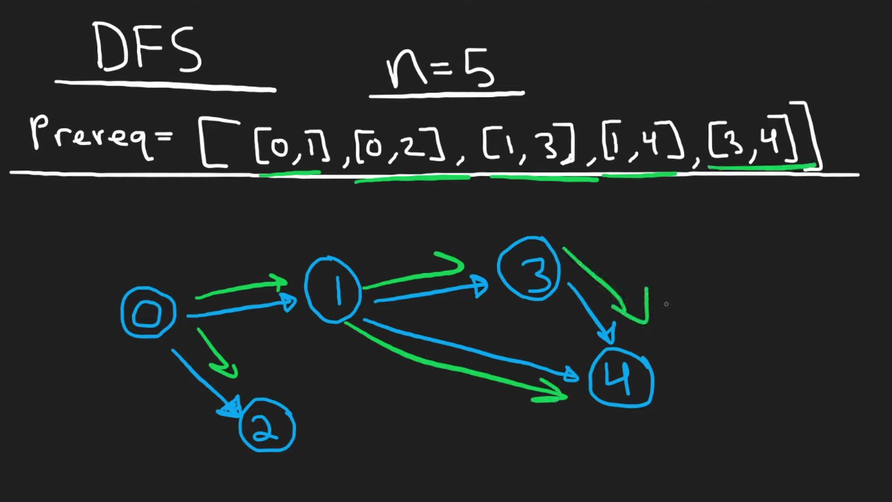
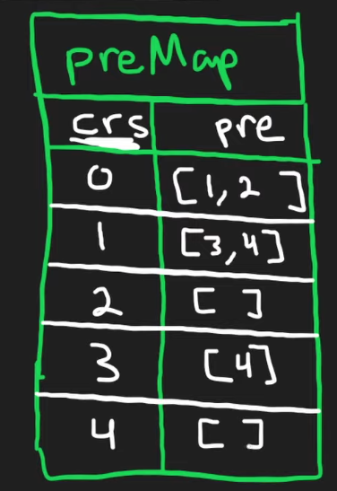
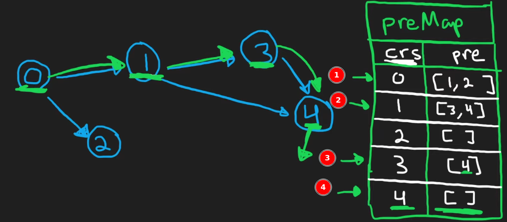
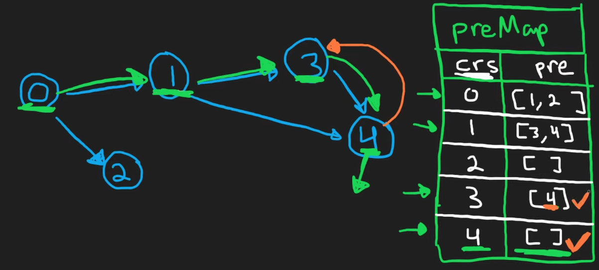
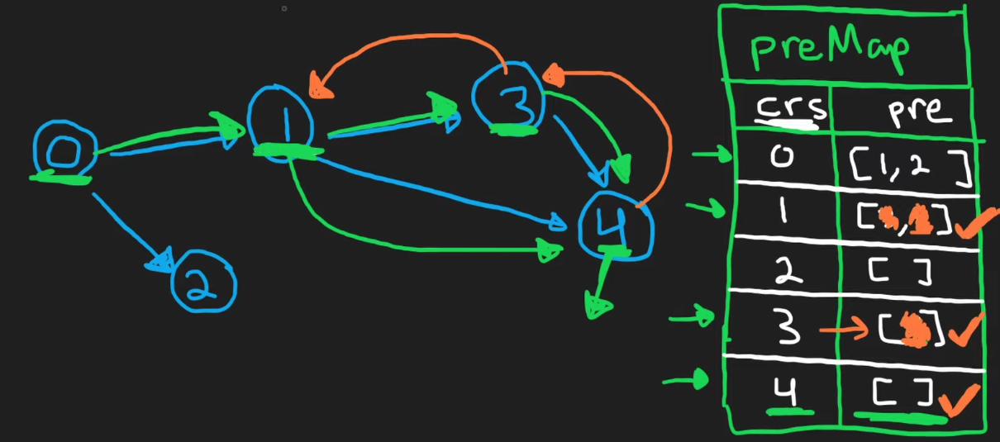
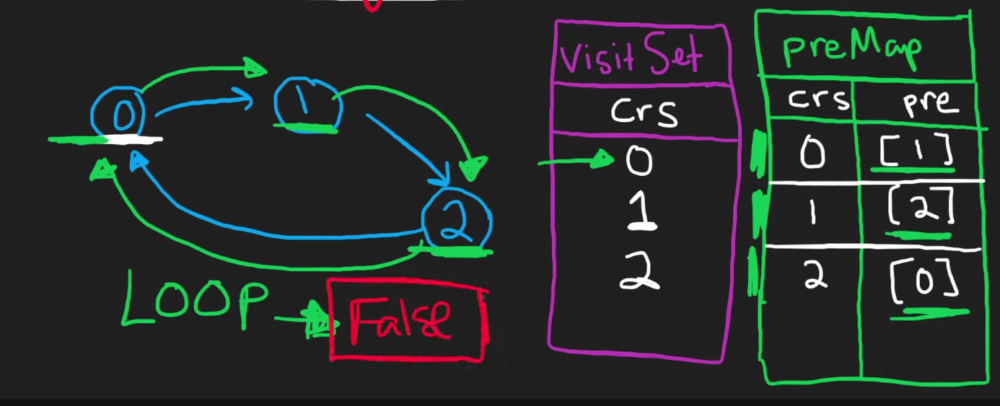

# Course Schedule

Primeiro de tudo, precisamos entender esse problema.

Os cursos são representados de 0..n, então se temos 2 cursos teremos:

0, 1 cursos

Se forem 4, teremos:

0, 1, 2 e 3

- Supondo n = 2, e prerequisitos = `[[1,0], [0,1]]`

Isso significa que:

1. [1, 0] -> para terminar o curso 1, precisamos terminar o curso 0. Ou seja, 0 é pré-requisito
2. [0, 1] -> para terminar o curso 0, precisamos terminar o curso 1, Ou seja, 1 é pré-requisito

Portanto, isso é impossível. Pois teremos um ciclo / loop no grafo.

## DFS

Exemplo:



Nesse caso, 2 e 4 não tem nenhum pré-requisito.

O 2 e 4, são os base cases, não precisam de pré-requisito.

Para isso, não precisamos de um grafo, podemos fazer um **map**.



Depois de montar o map de curso -> pré-requisitos, podemos montar o grafo de `[0, n-1]`

### Fluxo do DFS

Nesse DFS, vamos sempre percorrer **começando do curso de pré-requisito**.

1. Então, nesse exemplo, se fossemos começar do 0, até o último pré-requisito, iamos descobrir que o 4 pode ser feito, pois não tem pré-requisito.



Dai, vamos marcar o 4, para sabermos que conseguimos terminar ele.

2. Ao retonar ao 3, o pré-requisito dele é o 4. Como já fizemos, marcamos ele também, pois pode ser feito.



3. Ao voltar para o 1, podemos eliminar o 3, pois ele pode ser completado. E dai voltamos ao 4, para saber se pode ser comletado. Como ele pode, sabemos que o 1 cumpre todos pré-requisitos.



4. Ao voltar para o 0, sabemos que o 1 pode ser completado, então chegamos no 2. O 2 também pode, então está correto.


### Detectando Loops

Essa solução funciona, mas precisamos saber quando teremos um loop. Para isso podemos usar um dos dois:

- Array
- Set

Dessa forma, quando chegarmos a um elemento que já foi visitado no nosso DFS, retornamos false.



## Topological Sort

O algoritmo Topological Sort, é um método usado em teoria dos Grafos par aresolver o problema de scheduling. 

O Topological Sorting é usado em grafos **acíclicos direcionados** de todo grafo com vértice `(u, v)`, onde u vem antes de `v` na ordenação

### Analogia: Vestir Roupa pela Manhã

Imagina que você precisa se vestir pela manhã. Mas existe uma ordem obrigatória para colocar as peças de roupa:

- Você precisa colocar cueca antes de calça
- Você precisa colocar meia antes de sapato
- Você precisa colocar camisa antes de jaqueta

A pergunta é: é possível se vestir completamente? Ou existe alguma situação impossível tipo "para colocar a calça você precisa ter sapato, mas para colocar o sapato você precisa ter calça"? (Isso seria um ciclo impossível)

Isso é exatamente o problema de Course Schedule. Cursos são peças de roupa, e prerequisites são as dependências de ordem.

### O Conceito de In-Degree (Grau de Entrada)

In-Degree significa: quantas coisas precisam acontecer ANTES de você poder fazer isso.

Usando o exemplo de roupa:

- Cueca tem in-degree = 0 (você pode colocar direto, não depende de nada)
- Calça tem in-degree = 1 (depende de 1 coisa: cueca)
- Meia tem in-degree = 0 (pode colocar direto)
- Sapato tem in-degree = 1 (depende de 1 coisa: meia)

### Estratégia do algoritmo

**Passo 1:** Faça todas as coisas que você pode fazer AGORA (as que tem in-degree = 0), não dependem de nada.
**Passo 2:** Quando terminar algo, risca ela da lista. Agora as outras coisas que dependiam dela ficam "mais perto" de ficarem prontas (o in-degree delas diminui).
**Passo 3:** Repita até acabar tudo, ou até perceber que travou (quand otem ciclo impossível).

### Exemplo:

Input: ```numCourses = 2, prerequisites = [[1,0]]```

Para fazer curso 1, precisa fazer curso 0 primeiro.

- Grafo:

0 -> 1

- Calculand in-degree:

Curso 0: in-degree: 0 (ninguem aponta para ele, podemos começar direto)
Curso 1: in-degree = 1 (o curso 0 aponta para ele, precisa esperar para fazer)

**Execução do algoritmo**

**Iteração 1:** Quais cursos posso fazer agora?

- Lista de in-degree = 0
- ok, vou fazer o curso 0
- Quando termino o curso 0, atualizo os cursos que dependem dele:
    - Curso 1 tinha in-degree=1, agora vira 0
    - Adiciono o curso 1 na lista: [0, 1]

**Iteração 2:** Quais cursos posso fazer agora?

- Próximo da lista: curso 1
- Ok, vou fazer o curso 1
- Não tem mais ninguém dependendo dele, então acabou

**Resultado:** Consegui fazer todos os 2 cursos! Lista final tem tamanho 2. Return ```true```.

## Entendendo o código

Exemplo:

```
numCourses = 4
prerequisites = [[1,0], [2,0], [3,1], [3,2]]
```

Traduzindo em português:

- Para fazer curso 1, precisa fazer curso 0 antes
- Para fazer curso 2, precisa fazer curso 0 antes
- Para fazer curso 3, precisa fazer curso 1 antes
- Para fazer curso 3, precisa fazer curso 2 antes

Esse grafo fica:

```
    0
   / \
  1   2
   \ /
    3
```

Curso 0 desbloqueia cursos 1 e 2. Cursos 1 e 2 desbloqueiam curso 3.

### Parte 1: Inicialização - Construir o grafo e calcular in-degrees

```go
startGraph := make([][]int, numCourses)  // Lista de adjacência
inDegree := make([]int, numCourses)       // Quantas setas apontam pra cada nó

for _, p := range prerequisites {
    // p = [1, 0] significa "curso 0 -> curso 1"
    startGraph[p[1]] = append(startGraph[p[1]], p[0])  // De 0 para 1
    inDegree[p[0]]++  // Curso 1 tem mais uma dependência
}
```

Por partes:

1. Lista adjacente

```go
startGraph := make([][]int, numCourses)
```

- Criamos um slice de slices
- Cada **índice representa um curso**
- Cada índice vai guardar a lista de cursos que ele desbloqueia

Aqui nosso grafo de estados estaria:

```
startGraph = [
  [],  // curso 0 desbloqueia quais? (vazio por enquanto)
  [],  // curso 1 desbloqueia quais?
  [],  // curso 2 desbloqueia quais?
  []   // curso 3 desbloqueia quais?
]
```

2. Criando o in-degree (dependencias)

```go
inDegree := make([]int, numCourses)
```

**O que aconteceu:** Criamos um slice para contar quantas dependências cada curso tem.

**Estado agora:**

```
inDegree = [0, 0, 0, 0]
```

### Parte 2: Construir o Grafo (loop pelos pré-requisitos)

Aqui, processmos cada pré-requisito um por um

Lembrando:

```
numCourses = 4
prerequisites = [[1,0], [2,0], [3,1], [3,2]]
```

**Iteração 1**

```go
startGraph[p[1]] = append(startGraph[p[1]], p[0])
```

**Ou seja:** "O curso p[1] (que é 0) desbloqueia o curso p[0] (que é 1)". Então adiciona 1 na lista de desbloqueios do curso 0.

**Estado agora:**

```
startGraph = [
  [1],  // curso 0 desbloqueia curso 1
  [],
  [],
  []
]
```

```go
inDegree[p[0]]++
```

**Traduzindo:** "O curso p[0] (que é 1) tem mais uma dependência". Aumenta o contador.

**Estado agora:**

```
inDegree = [0, 1, 0, 0]
```

**Iteração 2** - ```p = [2, 0]```

Lembrando:

```
numCourses = 4
prerequisites = [[1,0], [2,0], [3,1], [3,2]]
```

```go
startGraph[p[1]] = append(startGraph[p[1]], p[0])
```

**Estado agora:**

```
startGraph = [
  [1, 2],  // curso 0 desbloqueia cursos 1 e 2
  [],
  [],
  []
]

```go
inDegree[p[0]]++
```

**Estado das dependências agora:**

```
inDegree = [0, 1, 1, 0]
```

**Iteração 3** - ```p = [3, 1]```

```go
startGraph[p[1]] = append(startGraph[p[1]], p[0])
```

**Estado agora:**

```
startGraph = [
  [1, 2],
  [3],     // curso 1 desbloqueia curso 3
  [],
  []
]
```

```go
inDegree[p[0]]++
```

**Estado agora:**
```
inDegree = [0, 1, 1, 1]
```

Curso 3 tem 1 dependencia.

**Iteração 4:** ```p = [3, 2]```

```go
startGraph[p[1]] = append(startGraph[p[1]], p[0])
```

**Estado agora:**

```
startGraph = [
  [1, 2],
  [3],
  [3],     // curso 2 desbloqueia curso 3
  []
]
```

```go
goinDegree[p[0]]++
```

**Estado agora:**

```
inDegree = [0, 1, 1, 2]
```

### Parte 3: Encontrar Cursos com In-Degree = 0

```go
inDegreeZeroList := make([]int, 0)
for node, d := range inDegree {
    if d == 0 {
        inDegreeZeroList = append(inDegreeZeroList, node)
    }
}
```

**O que aconteceu:** Percorremos o array `inDegree` procurando quais cursos têm zero dependências (podem começar agora).

Olhando `inDegree = [0, 1, 1, 2]`:

- Curso 0: d = 0 ✓ (adiciona)
- Curso 1: d = 1 ✗
- Curso 2: d = 1 ✗
- Curso 3: d = 2 ✗

**Estado agora:**

```go
inDegreeZeroList = [0]
```

### Parte 4: Processar Cursos

```go
for i := 0; i < len(inDegreeZeroList); i++ {
```

Nesse caso, esse loop começa com i = 0 e len(inDegreeZeroList) = 1.

**Iteração 1 do Loop** ```i = 0```

O curso sendo processado é inDegreeZeroList[0] = 0 (curso 0)

```go
for _, j := range startGraph[inDegreeZeroList[i]] {
```

Ou seja, para cada curso que o curso 0 desbloqueia

Temos: ```startGraph[0] = [1, 2]```

```go
inDegree[j]--
```

**Estado agora:**
```
inDegree = [0, 0, 1, 2]

Curso 1 tinha in-degree = 1. Agora virou 0. (porque fizemos curso 0 que ele dependia)

```go
if inDegree[j] == 0 {
    inDegreeZeroList = append(inDegreeZeroList, j)
}
```

Como virou 0, adicionamos curso 1 na lista!

**Estado agora:**

```
inDegreeZeroList = [0, 1]
```

```
inDegree[j]--
```

**Estado agora:**

```
inDegree = [0, 0, 0, 2]
```

Curso 2 tinha in-degree = 1, agora virou 0

```go
if inDegree[j] == 0 {
    inDegreeZeroList = append(inDegreeZeroList, j)
}
```

Como virou 0, adicionamos curso 2!

**Estado agora:**

```
inDegreeZeroList = [0, 1, 2]
```

**Iteração 2 do Loop** ```i = 1```

O curso sendo processado é inDegreeZeroList[1] = 1 (curso 1).

```go
for _, j := range startGraph[inDegreeZeroList[i]] {
```

```startGraph[1] = [3]```, então vamos iterar só sobre o curso 3.

Sub-iteração 2a: j = 3

```
goinDegree[j]--
```

**Estado agora:**

```
inDegree = [0, 0, 0, 1]
```

Curso 3 tinha in-degree = 2, agora virou 1.

```go
if inDegree[j] == 0 {
    // Não entra aqui porque ainda é 1, não 0
}
```

**Estado permanece:**

```
inDegreeZeroList = [0, 1, 2]
```

Loop externo checa: i = 1, len = 3

**Iteração 3 do Loop:** ```i = 2```

O curso sendo processado é ```inDegreeZeroList[2] = 2``` (curso 2)

```go
for _, j := range startGraph[inDegreeZeroList[i]] {
```

startGraph[2] = [3], vamos processar curso 3.

Sub-iteração 3a: j = 3

```go
goinDegree[j]--
```

**Estado agora:**

```
inDegree = [0, 0, 0, 0]
```

Curso 3 tinha in-degree = 1, agora virou 0!

```go
if inDegree[j] == 0 {
    inDegreeZeroList = append(inDegreeZeroList, j)
}
```

Adicionamos curso 3!

**Estado agora:**

```
inDegreeZeroList = [0, 1, 2, 3]
```

**Iteração 4 do Loop:** ```i = 3```

O curso sendo processado é inDegreeZeroList[3] = 3 (curso 3).

```go
for _, j := range startGraph[inDegreeZeroList[i]] {
```

startGraph[3] = [] -> vazio, não desbloqueia nada

Loop não entra, pula.

Loop externo checa: i = 3, len = 4. Continua...

i++ vira 4. Agora i = 4, len = 4. Não entra mais! Loop termina.

### Parte 5: Checagem Final

```go
return len(inDegreeZeroList) == numCourses
```

**Estado final:**

```
inDegreeZeroList = [0, 1, 2, 3]  (tamanho 4)
numCourses = 4
```