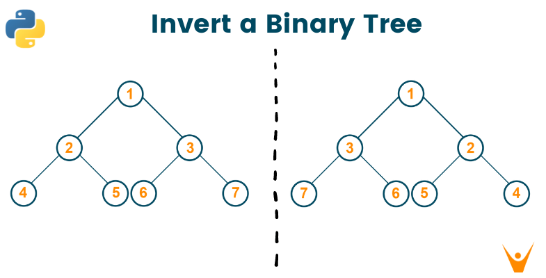

# Invert Binary tree

O que é inverter uma binary tree?

Basicamente, o elemento mais a direita (maior), vai virar o elemento mais a esquerda (menor).

Toda vez que visitarmos um elemento, precisamos olhar seus filhos e fazer o swap deles.

1. Para cada filho, inverta left com right
2. Depois, recursivamente para cada subtree, inverta a subtree (swap left com right a cada nível das subtrees):
    a. Primeiro na árvore esquerda
    b. Depois na árvore direita

ref: https://github.com/frankchang0125/leetcode/blob/master/226.invert-binary-tree.go

