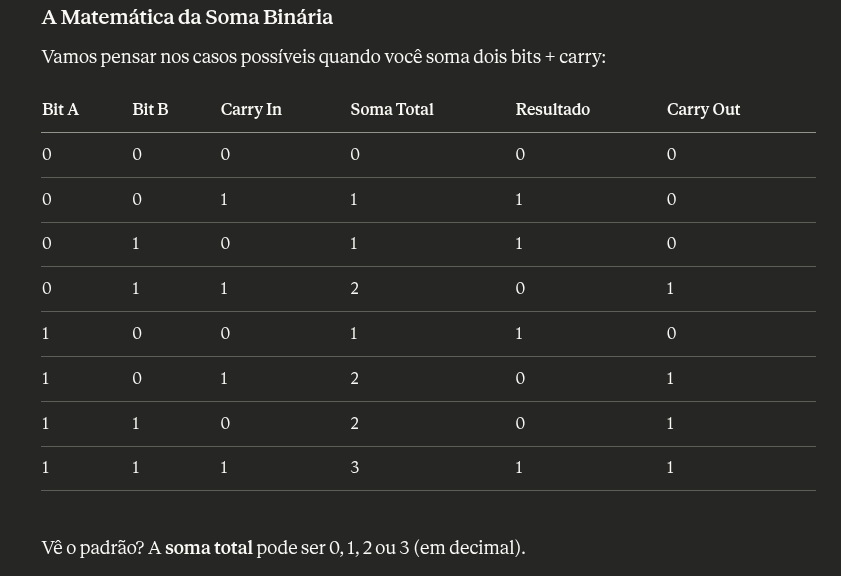

# Soma binária

## Entendendo o problema

Numa soma binária, é essencial entender que a **soma total ATUAL** pode chegar a 3, no caso onde:

```
bit a: 1
bit b: 1
carry: 1
```

Portanto:



Em binário, em cada posição só podemos ter 0 ou 1. Quando a soma passa de 1, **precisamos carregar** para a próxima posição.

**Exemplo:**

```
  27
+ 45
----
```

Na coluna das unidades: 7 + 5: 12

- Total = 2 (12 % 10)
- Carregamos (carry) = 1 (12 % 10)

Em binário ficaria:

```
  101  (5 em decimal)
+ 011  (3 em decimal)
-----
```

Na coluna da direita: 1 + 1 = 2 (em decimal)

- Escrevemos 0 (2 % 2 = 0) ----> mod 2 pois é binário
- Carregamos (carry) 1 (2 / 2 = 1)

### Fórmula:

```
- tmp = 0 -> carry = 0/2 = 0 (nada para carregar)
- tmp = 1 -> carry = 1/2 = 0 (1 cabe em binário, sem carry)
- tmp = 2 -> carry = 2/2 = 1 (2 = "10" em binário, carry o 1)
- tmp = 3 -> carry = 3/2 = 1 (3 = "11" em binário, carry o 1)
```

--- 

## Por quê usamos 'sum % 2' para o dígito atual?

O `% 2` (módulo 2) dá o **resto** da divisão por 2, que é o bit que precisamos naquela posição.

Exemplo:

```
- tmp = 0 -> 0 % 2 = 0 -> escreve 0
- tmp = 1 -> 1 % 2 = 2 -> escreve 1
- tmp = 2 -> 2 % 2 = 0 -> escreve 0 (porque 2 em binária é "10")
- tmp = 3 -> 3 % 2 = 1 -> escreve 1 (porque 3 em binário é "11")
```

Então, precisamos ver se o número é par ou ímpar:

- Se par (0, 2) -> escrevemos 0
- Se ímpar (1, 3) -> escrevemos 1

--- 

## Conversão de caractere para inteiro usando ASCII

IMPORTANTE: Conversão de caractere em inteiro

'1' em ASCII tem valor 49
'0' em ASCII tem valor 48

- quando fazemos a[lenA-1]-'0':

```
'1' - '0' = 49 - 48 ---> 1 -> agora virou o número 1 que queremos
'0' - '0' = 49 - 49 ---> 0
```

---

## Por que strconv.Itoa(tmp%2) + res (concatenar antes de res)?

É importante lembrar: ao somar estamos processando da **direita para a esquerda**

### Exemplo: somando "11" + "1":

**Passo 1** (posição mais a direta)

- `tmp = 1 + 1 = 2`
- Digito: `2 % 2 = 0`
- `res = "0" + ""` -> `res = "0"`
- `carry = tmp / 2` -> `carry = 1`

**Passo 2** (próxima posição)

- `tmp = 1 + 0 (carry = 1) = 2`
- Dígito: `2 % 2 = 0`
- `res = "0" + "0"` -> `res = "00"`
- `carry = tmp / 2` -> `carry = 1`

**Passo 3**

Como carry = 1

- `res = "1" + "00"` -> `res = "100"`

Portanto, se fizessemo `res = res + strconv.Itoa(tmp%2)` ficaria invertido ("001"), res deve ser depois